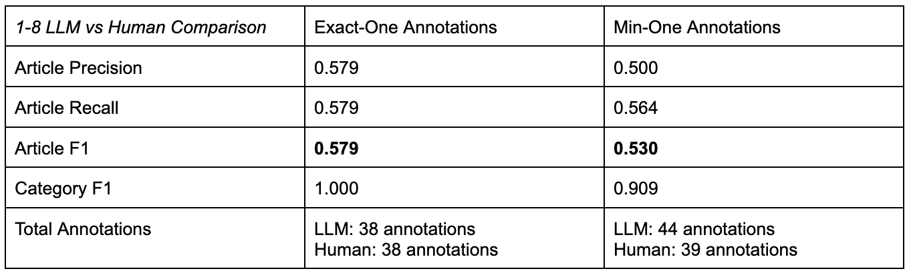

# Sensify Lab: Community Comms Project, MTurk Survey Tool

**Principal Developer:** Kathleen Higgins (Summer 2025)
**Principal Investigator:** Prerana Khatiwada (PhD) and Professor Matthew Mauriello

## Notes
## May 9th, 3:01pm:
Okay, so we've been thinking of how to improve IRR. Really, I've been rethinking IRR period. It's a really tough metric to use on something as subjective as open-form annotation of polarizing language. That's, like, insane. So, I was thinking of another way to still do IRR, but to report on a metric that takes the focus away from *did we all spot the same things the first time*---which implies an objective ground truth, which we do **not** have---and instead bringing the focus to, when we have our finished annotations (that we did open-form, without prompting)---do we agree with each other?

Okay, so there are two seperate groups of metrics for that. 
To answer the first bit, of how well did we do on the open-form annotations. I've been handling everything on the paragraph level. The algorithm walks (I believe) through the following steps:
1. Are we talking about the same article?
2. Are we talking about the same paragraph?
3. Look at the annotations that the annotator has made for the paragraph. 
  What's their binary level selection (polarizing/not polarizing)?
  What's their category level selection (no polarizing language, inflammatory language, persuasive propaganda)
  What's their subcategory level selection (exaggeration, slogans, bandwagon, casual oversimplification, doubt, name-calling, demonization, scapegoating)
4. Collapse their annotation label into three overarching labels (ex. the whole paragraph is labeled as not polarizing/persausive propaganda/bandwagon). If there are multiple conflicting annotations for polarizing language, select the most common category/subcategory, and if there is still a tie remaining, select the first annotation in the paragraph.
5. Compare binary/category/subcategory selection across the three adjudicators on the paragraph level to obtain the final IRR. 

```
I've traditionally been looking at original annotation IRR (as a reminder, our scores are binary: pairwise 0.498, kripp. alpha -0.020. category: pairwise 0.375, alpha 0.035. subcategory: pairwise 0.268, alpha 0.033). (edited)
```

```
But if we look at adjudicated IRR, it's much better. Adjudicated IRR is agree/disagree on spans, and we do much better there. Pre adjudication, on our original raw votes, our pairwise percent agreement is 0.657 and our krippendorf's alpha is 0.311. Post adjudication, our pairwise percent agreement is 0.713 and our krippendorf's alpha is 0.409.
So instead of using the original raw annotation IRR, which is really tough---because it's unstructured and free form---we could report adjudicated IRR instead, basically answering the question of did we reliably agree/disagree with each others annotations.
Little bit more abstracted, but much less harsh of a metric.
```

### May 6th, 4:36pm:
- Bringing in the final adjudicated set---I had a first version created by Codex, but I wanted a consolidated final set from Prerana, and this is what it is. There's also a file called `final_adjudicated_set`, but what is the real deal is `src/dataset_comparison_scripts/statistical_analysis/2-20/adjudicated_full_final_inhouse/Final_consolidated_with_adjudication_subbed_in_set_inhouse - Final set from adjudicated labels_April 24.csv`. 

What that path is to a file that contains the in-house annotations with the adjudicated set that Ashrey, Aarush, and Prerana disucssed over (when they pulled the highest disagreement annotations and debated within themselves, and got things up to 3-0 agreement); it has the original in-house annotations with the adjudicated swapped in.


`/Users/kathleenhiggins/mturkstudy-3/src/mturk_results/2-20/cisc475database-default-rtdb-submissions-export.json` is the location of the 2-20 in-house annotations. This means Ashrey, Aarush, and Prerana's annotations on the 27 highest-polarization articles. 

# Updates.md
Written by Kathleen Higgins, begun on January 8th (though I've been working on the project for a year and a half, now) to include recent updates so I can go back and check what I did. 

## February 14th, 10:59am:


## February 5th, 10:04pm:
Explanation of LLM scripts:
```
Save every model output (no aggregation/adjudication): run_wrapper_multiple_llm_annotations_per_model.py (writes annotator_A, annotator_B, annotator_C for each article).
Consensus / committee aggregation (3 annotators + OpenAI adjudicator produces one final per article): run_wrapper_multiple_llm_annotations.py (writes a final-json plus a results-csv that contains the raw per-annotator JSON strings).
Same consensus pipeline, just a convenience default: run_wrapper_multiple_llm_annotations_flexible.py (calls the consensus script but defaults --paragraph-policy min-one + default output paths).
Other LLM-related files that don’t fit those two buckets:

Wrapper entrypoint only (no new logic; just runs the consensus script): multiple_llm_annotations_script.py.
Notebook version / historical development artifact (not the canonical CLI): Multiple_LLM_Annotations_Script.ipynb.
```

## February 2nd, 5:51pm:
```
python src/dataset_comparison_scripts/run_wrapper_multiple_llm_annotations.py `
  --input public/article_dataset_versions/test3_encoding_fixed_300_700_words_paragraphs.csv `
  --paragraph-policy exact-one `
  --results-csv src/dataset_comparison_scripts/annotated_results_3annotators_full_300_700.csv `
  --final-json src/llm_annotation_results/final_annotations_3annotators_full_300_700.json
```

## January 29th, 9:57pm:
- Testing to make sure that my commits work.
- I'm trying to make the heatmap look better by getting more data. Essentially, I'm moving away from the consolidation process of the one-per-paragraph (a change I've already made earlier and will sustain) and additionally, just for the sake of being able to compare the number of category annotations of the LLM versus the humans in MTurk, I'm running another version of the LLM script that doesn't use an aggregation method; instead it saves everything as-is. It's quite nice, and I'm doing something similar with not processing the Turk results, where I can just see total counts overall in the heatmap of what the models annotate. 
- Also, for my Goldwater paper, I'm running with the 1-20 HIT as our MTurk HIT to which I'm using our data on.

## January 28th, 7:57pm:
- Results from Krippendorf's Alpha and Inter-Annotator Agreement:
```
(base) kathleenhiggins@wifi-roaming-128-4-187-79 mturkstudy-3 % python src/dataset_comparison_scripts/statistical_analysis/inter_annotator_agreement_1_8.py
Inter-Annotator Agreement (1-8 HIT)
=================================
Input file: /Users/kathleenhiggins/mturkstudy-3/src/dataset_comparison_scripts/statistical_analysis/../../mturk_results/archived_mturk_results/1-8/1-8HIT_2026_01.json
Annotators: 37
Units (article, paragraph): 38
Units by # annotators: {3: 35, 4: 3}
Worker-paragraph labels: 117
Mixed NPL+polarizing labels: 3
Multi-category polarizing labels: 7

Binary Labels (NPL vs Polarizing)
---------------------------------
Label counts: {'No Polarizing Language': 41, 'Polarizing Language': 76}
Pairwise agreement: 58.54%
Krippendorff's alpha (nominal): 0.0764
Majority labels: {'No Polarizing Language': 10, 'Polarizing Language': 28}
Tied majorities: 0 (tie breaker: npl)

Category Labels (NPL vs Category)
---------------------------------
Label counts: {'No Polarizing Language': 41, 'Persuasive Propaganda': 56, 'Multiple Polarizing Categories': 7, 'Inflammatory Language': 13}
Pairwise agreement: 39.02%
Krippendorff's alpha (nominal): 0.0289
```

## January 28th, 5:07pm:
- Added Krippendorf's alpha and interannotator agreement. 
```
Here’s what’s worth knowing about the design decisions baked into inter_annotator_agreement_1_8.py:

1. Unit of analysis

The script treats each (article_id, paragraphIndex) as a unit.
This is consistent with your paragraph‑level pipeline, but it means agreement is per paragraph, not per article or per span.
2. Worker labeling rule per paragraph

A worker’s paragraph label is derived from their annotations in that paragraph.
If they mark any polarizing span, the paragraph is Polarizing (for the binary label).
If they mark only NPL, it’s NPL.
3. Mixed selections

If a worker marks both NPL and polarizing within the same paragraph, it is still treated as Polarizing (binary).
These are counted as mixed_npl_and_polarizing so you can see how often it happens.
4. Category‑level labels

If a worker uses multiple polarizing categories in a paragraph, it becomes “Multiple Polarizing Categories.”
That avoids forcing a single category but lowers agreement because it’s a distinct label.
5. No weighting for support

Every worker’s paragraph label counts equally.
There is no confidence weighting or enforcement of 2/3 agreement inside this script.
6. No span‑matching

The script ignores span overlap entirely.
It’s strictly a paragraph‑level decision based on what the worker chose, not how the text matches.
7. IAA metrics

It reports pairwise agreement and Krippendorff’s alpha (nominal).
Alpha is sensitive to category imbalance and low variability, which is why it looks small here.
8. Tie handling in majority vote

Ties in the majority vote are resolved with the MAJORITY_TIE_BREAKER.
Right now it defaults to "npl", but you can flip it to "polarizing" or "exclude".
```

## January 28th, 4:46pm:
- Added confidence intervals. Not sure if I like what I'm seeing, but it's on 12 articles, so it's fine. Will not be mentioning this in m paper, haha. 

## January 28th, 2:26pm:
- Quick note that the latest 1-20_hit_gold_standard JSON file is not enforcing one-annotation-per-paragraph.  
- 
## January 28th, 2:10pm:
- Quick note of the script updates:
```
Done.

1) Same Script, Toggleable Policy
Updated run_wrapper_multiple_llm_annotations.py to support:

--paragraph-policy exact-one (default; preserves current behavior)
--paragraph-policy min-one (flexible: keep all polarizing spans per paragraph, otherwise one NPL; always ≥1 annotation/paragraph)
This is applied only to the FINAL adjudicated output, same as before.

2) Second “Flexible” Script Preserving the First
Added run_wrapper_multiple_llm_annotations_flexible.py, which defaults to:

--paragraph-policy min-one
final_annotations_3annotators_multi.json
annotated_results_3annotators_multi.csv
So you don’t overwrite the original outputs.

If you want the flexible version to also keep NPL alongside polarizing spans (instead of dropping NPL when polarizing exists), tell me and I’ll adjust that policy.
```

## January 28th, 12:31pm:
- Revised to have a second version of the original LLM and Turk aggregation scripts to support multiple annotations. Reorganization for simplification still needed of the codebase. 

## January 25th, latest two runs (1-8 HIT vs. in-house, same 12 articles):
- Both runs enforce one annotation per paragraph, so precision == recall at the article-match level.
- 1-8 HIT (MTurk):
```
Confidence weighting enabled: True
Article Match: {'precision': 0.579, 'recall': 0.579, 'f1': 0.579, 'correct_matches': 22, 'total_llm': 38, 'total_gold': 38}
Category Match: {'precision': 1.0, 'recall': 1.0, 'f1': 1.0, 'correct_matches': 22, 'total_matches': 22}
Weighted Article Match: {'precision': 0.428, 'recall': 0.553, 'f1': 0.483, 'tp_weight': 11.98, 'total_gold_weight': 21.65, 'fp': 16}
```
- In-house (same twelve articles):
```
[12:26 PM]=== Overall Results ===Confidence weighting enabled: TrueArticle Match: {'precision': 0.842, 'recall': 0.842, 'f1': 0.842, 'correct_matches': 32, 'total_llm': 38, 'total_gold': 38}Category Match: {'precision': 0.969, 'recall': 0.969, 'f1': 0.969, 'correct_matches': 31, 'total_matches': 32}Weighted Article Match: {'precision': 0.807, 'recall': 0.867, 'f1': 0.836, 'tp_weight': 25.1, 'total_gold_weight': 28.95, 'fp': 6} (edited) [12:27 PM]
```
- Bottom line: article-match F1 is 0.579 (MTurk) vs. 0.842 (in-house), a +0.263 absolute difference (~26.3 percentage points).

## January 25th, 9:54am:
```
Category Info: compared the latest in‑house annotations to the LLM output using one annotation per paragraph, yielding 38 annotations each. There were 32/38 matches. Of those matches, 31/32 were “no polarizing language.” The single non‑no‑polarizing match was a category disagreement: in‑house labeled it “inflammatory language,” while the LLM labeled it “persuasive propaganda.”For the 6 mismatches, the disagreement types were evenly split:2/6 (33.33%): LLM marked “no polarizing,” in‑house marked polarizing.2/6 (33.33%): LLM marked polarizing, in‑house marked “no polarizing.”2/6 (33.33%): both marked polarizing, but chose different snippets/categories within the paragraph.The category match rate for inflammatory language and persuasive propaganda is 0%, since the only annotation not for "no polarizing language" the in-house and LLM disagreed on category. In summary, most all matches come from shared judgments that the paragraph contains no polarizing language. the remaining disagreements are evenly distributed across the three mismatch types. (edited) Kathleen Higgins  [9:15 AM]Let me know what more data and questions you have. Essentially, because 86.84% of total annotations are for no polarizing language, it's basically become a binary yes/no for no polarizing language task.Kathleen Higgins  [9:22 AM]The dominance of no polarizing language annotations for both humans and LLMs also is a result of the current data processing that emphasizes conservatism. The LLM prompting emphasizes carefulness ("if unsure, choose no polarizing language") and the current aggregation of the human annotations requires 2/3 annotators to agree for the annotation to be saved---which cuts out the junk of random poor annotations, but will save the annotation as "no polarizing language" if that 2/3 standard isn't met---reducing the variance of the human annotations.[9:22 AM]Additionally, currently a one-annotation-per-paragraph rule is being enforced.Kathleen Higgins  [9:47 AM]It's also hard to over emphasize how much of an impact data processing has on the final scores. Here is a diagram of the current data processing. The current structure emphasizes agreement and conservatism. If there's an interest in seeing scores with no enforcement of one annotation per paragraph or 2/3 Turker agreement, I can rewrite the processing scripts.
```

## January 23rd, 12:30pm:
- Bro.
```
[12:26 PM]=== Overall Results ===Confidence weighting enabled: TrueArticle Match: {'precision': 0.842, 'recall': 0.842, 'f1': 0.842, 'correct_matches': 32, 'total_llm': 38, 'total_gold': 38}Category Match: {'precision': 0.969, 'recall': 0.969, 'f1': 0.969, 'correct_matches': 31, 'total_matches': 32}Weighted Article Match: {'precision': 0.807, 'recall': 0.867, 'f1': 0.836, 'tp_weight': 25.1, 'total_gold_weight': 28.95, 'fp': 6} (edited) [12:27 PM]
```
- Em so I suppose we have our answer. Literally a >20 percentage point difference between the Turkers (57.9% agreement with LLM) and our in-house annotations (84.2% agreement with our LLM). 
- So this is good, in terms of it confirming my hypothesis, but it does mean that we'll have to take this into account into how we restructure the project.

## January 17th, 4:17pm:
- I kept mixing up which JSON files were right and which ones were out of date, so I 

## January 13th, 11:54pm:
To-Do List (post-meeting):
- Send JSON file for the interns to annotate. 
- Send JSON to Varun of the finished LLM annotations. 

***To-Do List***
## January 8th, 8:00pm:
- Realized I was doing something mad stupid, and I didn't update the comparison script to work with the per-paragraph LLM json. 
```
Confidence weighting enabled: True
Article Match: {'precision': 0.579, 'recall': 0.579, 'f1': 0.579, 'correct_matches': 22, 'total_llm': 38, 'total_gold': 38}
Category Match: {'precision': 1.0, 'recall': 1.0, 'f1': 1.0, 'correct_matches': 22, 'total_matches': 22}
Weighted Article Match: {'precision': 0.428, 'recall': 0.553, 'f1': 0.483, 'tp_weight': 11.98, 'total_gold_weight': 21.65, 'fp': 16}
```

## January 8th, 5:31pm:
- Added the first bit of data from the most recent HIT. 

## Repository Design
```
mturkstudy-3/
├─ README.md
├─ updates.md
├─ package.json
├─ package-lock.json
├─ public/
├─ src/
│  ├─ website_management/                 # React annotation tool (UI)
│  │  ├─ pages/
│  │  ├─ components/
│  │  └─ helper_scripts/
│  │
│  ├─ dataset_comparison_scripts/         # Core pipelines + evaluation
│  │  ├─ run_wrapper_multiple_llm_annotations.py
│  │  ├─ run_wrapper_multiple_llm_annotations_flexible.py
│  │  ├─ paragraph_llm_human_comparison.py
│  │  ├─ paragraph_turk_annotation_aggregator.py
│  │  ├─ multiple_llm_annotations_script.py
│  │  ├─ requirements_llm_notebook.txt
│  │  ├─ per_model_annotations/
│  │  │  └─ run_wrapper_multiple_llm_annotations_per_model.py
│  │  ├─ statistical_analysis/
│  │  │  └─ inter_annotator_agreement_1_8.py
│  │  └─ archived_comparison_scripts/
│  │
│  ├─ helper_scripts/                     # Figures / analysis helpers
│  │  ├─ visualize_llm_vs_raw_mturk_subcategory_confusion_matrix_pooled.py
│  │  ├─ visualize_precision_recall_llm_vs_raw_mturk_by_category_severity.py
│  │  └─ gold_standard_visualizations/
│  │     ├─ visualize_llm_vs_gold_subcategory_confusion_matrix.py
│  │     └─ visualize_precision_recall_by_category_severity.py
│  │
│  ├─ llm_annotation_results/             # LLM outputs (current + archived)
│  │  ├─ final_annotations_3annotators.json
│  │  ├─ multi_llm_annotations/
│  │  ├─ per_model_annotations/
│  │  └─ archived_llm_annotations/
│  │
│  ├─ mturk_results/                      # MTurk outputs (current + archived)
│  │  ├─ 1-20_hit_gold_standard_output.json
│  │  ├─ archived_mturk_results/
│  │  │  └─ 1-8/
│  │  │     ├─ 1-8HIT.json
│  │  │     └─ 1-8HIT_2026_01.json
│  │  └─ ...
│  │
│  └─ data_visualizations/                # Saved plots (PNG) + mpl cache
│     └─ ...
└─ annotation_comparison_results.json
```

This project is divided into several sections. 

Table of Contents: 
- News Annotation Platform
- Annotation Aggregation Scripts 
- LLM Scripts
- LLM vs Turker Comparison Process 

## Important Files Description

This script (run_wrapper_multiple_llm_annotations.py ) is a multi-LLM annotation pipeline for news articles. It reads a CSV of articles, sends each article to three annotators (two OpenAI-style roles and one Gemini/OpenAI annotator), then sends their outputs to an OpenAI adjudicator to produce one final annotation set.
It also does a lot of cleanup and validation: it enforces the JSON schema, normalizes labels, repairs missing fields, assigns paragraph indices, and applies a paragraph policy like exactly one annotation per paragraph or minimum one annotation per paragraph. Finally, it saves the raw annotator outputs to a CSV and the final adjudicated annotations to JSON, with resume/checkpoint support so long runs do not get lost.




This script ( /run_wrapper_multiple_llm_annotations_per_model.py) runs three LLM annotators (A, B, C) on the same set of articles but does NOT combine or adjudicate their outputs. Instead, it saves each model’s annotations separately so you can analyze model disagreement and variability. It also enforces a minimum-one-per-paragraph policy, ensuring every paragraph has at least one annotation while still allowing multiple annotations when present.


This script (multiple_llm_annotations_script)  is just a wrapper/launcher, it doesn’t do any annotation or processing itself.
Its only job is to run another script (run_wrapper_multiple_llm_annotations.py) using runpy. So when we execute this file, it simply forwards execution to the main annotation pipeline.


This script (llm_human_comparison.py) compares LLM-generated annotations with gold-standard human annotations. It matches spans and labels between the two, then computes precision, recall, and F1 scores to measure how well the LLM performed. It also supports confidence-weighted evaluation, where higher-confidence gold annotations are given more importance, and outputs both overall metrics and per-article results.


This script ( turk_annotation_aggregator.py ) builds a gold-standard annotation file from the MTurk annotations. It groups together overlapping spans across annotators, chooses the most common category/subcategory for each group, computes a confidence score based on how many annotators supported it and whether their labels were consistent, and then saves the result in a clean article-level JSON format for later comparison with LLM annotations. It also carries over article titles and extracts a shared overlap-based text span to represent each grouped annotation.



 
The script (in_house_density_and_agreement.py ) analyzes our in-house annotation dataset to compute overall statistics and agreement. It measures things like label distribution (density), span overlap between annotators, and inter-annotator reliability (agreement, Cohen’s kappa, Krippendorff’s alpha) at binary, category, and subcategory levels. It also includes one-vs-rest analysis for specific labels to understand how consistently each type of propaganda is identified.



This script (in_house_overlap_restricted_reliability.py) computes inter-annotator reliability (IRR) for the dataset in two ways: on the full dataset and on overlap-restricted subsets. It filters to cases where all annotators marked polarizing content (and even shared overlapping spans), then recalculates agreement (kappa, alpha, etc.) to see if disagreement is due to different span selection vs actual label disagreement. It outputs both a JSON file and a readable Markdown report with interpretation.

This script ( paragraph_llm_human_comparison.py ) compares LLM annotations and human gold-standard annotations at the article + paragraph level. It matches spans only when they come from the same article and same paragraph, then computes precision, recall, F1, category/subcategory performance, and confidence-weighted metrics to evaluate how well the LLM agrees with the gold labels.
It also supports a few extra evaluation options: we can enforce one annotation per paragraph for stricter apples-to-apples comparison, print matched pairs for a specific article for debugging, and optionally compute bootstrap confidence intervals for the overall metrics. In short, it is a more advanced comparison/evaluation script for measuring LLM-vs-human annotation performance under different settings.

This script (paragraph_turk_annotation_aggregator) builds a human gold-standard annotation file from the MTurk data, but in a more flexible way. It groups overlapping annotations within the same article and paragraph, computes a confidence score based on how many annotators supported each label, and then saves only annotations that meet a chosen minimum supporter threshold.
It also supports two modes: exact-one, where it keeps only the single best annotation per paragraph, and min-one, where it can keep multiple qualifying polarizing annotations per paragraph and only uses a No Polarizing Language placeholder when needed. In short, this is a more advanced gold-standard builder that lets you control how strict or permissive the final human reference file should be.


## News Annotation Platform 

This is a browser-based annotation platform for labeling persuasive propaganda, inflammatory language, and misleading content in news articles. Designed for MTurk and human-subject studies.

### Location: 
/mturkstudy/src/website_management

### Features

- Highlight text and apply structured labels
- Customizable categories and survey questions
- Supports article-by-article surveys
- JSON export or Firebase integration
- “Thank You” screen with MTurk code

### Customization via `config.js`

To adapt the tool for your own study, edit `config.js`:

- `articles`: your article text and titles
- `categoryOptions`: tags available to annotators
- `surveyQuestions`: Likert-style post-annotation questions

## Getting Started

1. Clone this repo
2. Run `npm install`
3. Update `config.js`
4. Run locally: `npm start`
5. Optionally deploy on Vercel, Netlify, or Firebase

### Example Output

At the end of the task, all annotations and survey responses are saved as structured JSON and can optionally be uploaded to Firebase.

## Scheduled Firebase Sync

The repo now includes a scheduled GitHub Actions workflow at
`.github/workflows/firebase-daily-sync.yml` that exports these Firebase
Realtime Database nodes:

`src/mturk_results/live/cisc475database-default-rtdb-submissions-export.json`
`src/llm_annotation_results/live/cisc475database-default-rtdb-LLMAnnotations-export.json`

The export is performed by
`src/website_management/helper_scripts/export_firebase_snapshot.mjs`.

Setup requirements:
- Add a GitHub Actions secret named `FIREBASE_SERVICE_ACCOUNT_JSON`.
- Paste in the full contents of your local `serviceAccountKey.json`.
- The workflow runs every morning at `9:00 AM` in `America/New_York`.

Implementation note:
- GitHub Actions cron is UTC, so the workflow schedules both `13:00` and `14:00` UTC and only proceeds when the runner's local New York hour is `09`. That keeps the run aligned with daylight saving time.

Local manual export example:

```bash
node src/website_management/helper_scripts/export_firebase_snapshot.mjs \
  --serviceAccount serviceAccountKey.json \
  --output src/mturk_results/live/cisc475database-default-rtdb-submissions-export.json
```

### Notes: `in_house_live_validation_three_way_split_clusters.csv`

- File: `src/dataset_comparison_scripts/statistical_analysis/live/in_house_live_validation_three_way_split_clusters.csv`
- This is an adjudication-focused CSV built from the live `InHouse-Annotations` validation data after overlapping same-subcategory proposals are consolidated into clusters.
- Each row is a consolidated cluster with an exact 3-vote split pattern of `2-1` or `1-2`, meaning one validator disagreed with the other two about whether that annotation should be kept.
- We made it so the hard in-house cases can be re-reviewed in a second agree/disagree pass instead of re-validating the entire dataset.
- The CSV includes the article title, paragraph index, vote pattern, category, subcategory, representative span text, representative annotator, and the underlying clustered span texts/metas.
- It is meant to function as a working notes/adjudication sheet for improving the final approved human set and, if needed, raising validation agreement metrics like Krippendorff’s alpha.

### Designed For Research

This tool was created for a human-subject study but is reusable across research domains involving:
- Misinformation
- Bias detection
- Media literacy

## License

MIT License

## Annotation Aggregation Scripts 

### Location: 
/mturkstudy/src/gold_standard_dataset

### About:
Contains code that aggregates the work of different annotators into a single dataset that contains confidence scores that can be compared to LLMs. 
