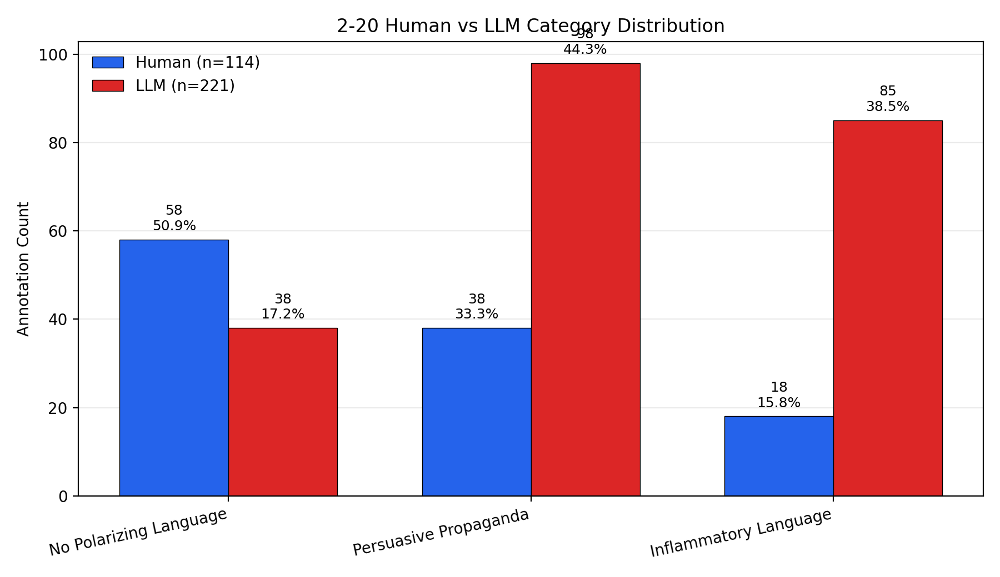
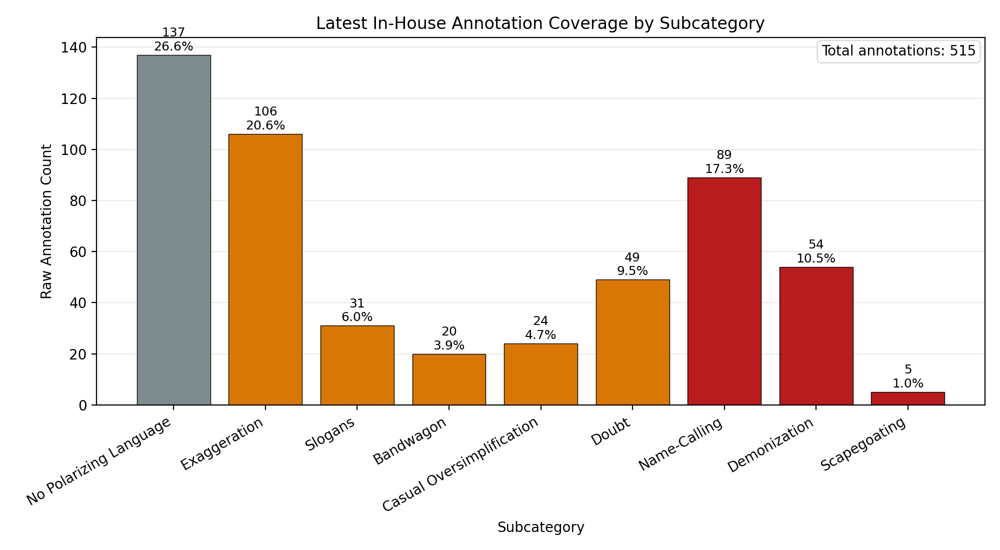
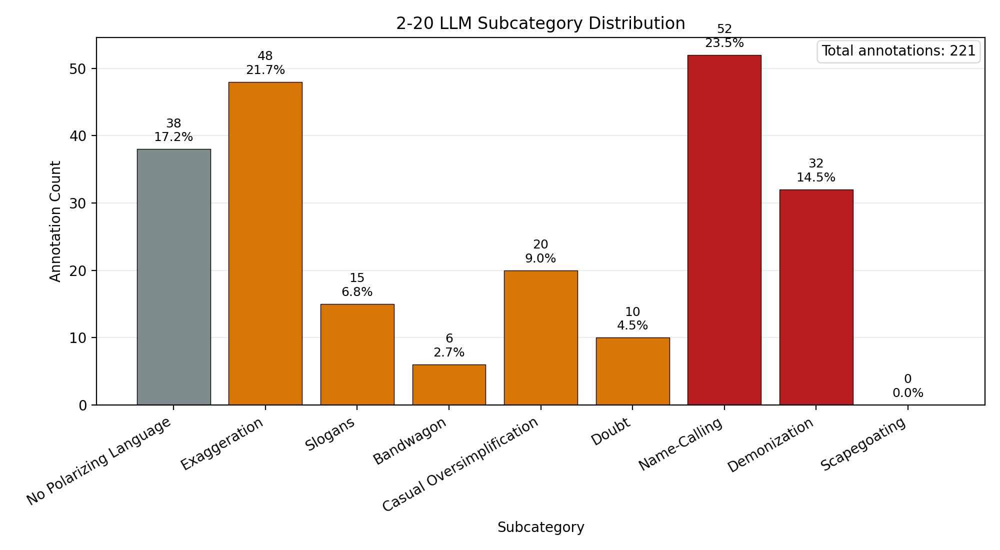

# 2-20 Analysis Report

## Scope

This document consolidates the `2-20` human/LLM comparison outputs, the `2-20` category and subcategory coverage graphics, and the latest in-house density/agreement summary that was computed from the raw in-house file.

Important distinction:

- The **2-20 human subcategory coverage** figure uses the **raw worker annotations** from [2-20_polarizing_annotation.json](../../../mturk_results/2-20/2-20_polarizing_annotation.json).
- The **2-20 human vs LLM category comparison** uses the **aggregated human min-one gold standard** from [2-20_human_min_one_gold_standard_output.json](../../../mturk_results/2-20/2-20_human_min_one_gold_standard_output.json) against the final LLM annotations from [2-20_llm_min_one_final_annotations_3annotators.json](../../../llm_annotation_results/2-20/2-20_llm_min_one_final_annotations_3annotators.json).

## Key Graphics

### 2-20 Human vs LLM Category Distribution

This plot compares the aggregated human gold-standard annotations against the final LLM annotations for the 27 selected `2-20` articles.

### 2-20 Human Raw Subcategory Distribution

This plot shows the raw worker subcategory distribution from the `2-20` HIT export before aggregation.

### 2-20 LLM Subcategory Distribution

This plot shows the final adjudicated LLM subcategory distribution for the same 27 selected articles.

## 2-20 Category Comparison Summary

### Aggregated Human Gold vs Final LLM

| Category | Human Count | Human Share | LLM Count | LLM Share |
| --- | ---: | ---: | ---: | ---: |
| No Polarizing Language | 58 | 50.9% | 38 | 17.2% |
| Persuasive Propaganda | 38 | 33.3% | 98 | 44.3% |
| Inflammatory Language | 18 | 15.8% | 85 | 38.5% |

Totals:

- Human aggregated gold annotations: `114`
- Final LLM annotations: `221`
- Articles compared: `27`

## 2-20 Raw Human Subcategory Coverage

Source: raw worker annotations from [2-20_polarizing_annotation.json](../../../mturk_results/2-20/2-20_polarizing_annotation.json)

Dataset summary:

- Worker submissions: `93`
- Selected articles: `27`
- Worker-paragraph units: `291`
- Raw annotations: `515`

| Subcategory | Count | Share of Raw Annotations |
| --- | ---: | ---: |
| No Polarizing Language | 137 | 26.6% |
| Exaggeration | 106 | 20.6% |
| Name-Calling | 89 | 17.3% |
| Demonization | 54 | 10.5% |
| Doubt | 49 | 9.5% |
| Slogans | 31 | 6.0% |
| Casual Oversimplification | 24 | 4.7% |
| Bandwagon | 20 | 3.9% |
| Scapegoating | 5 | 1.0% |

Coverage result:

- Missing subcategories: none

## 2-20 Final LLM Subcategory Coverage

Source: final LLM annotations from [2-20_llm_min_one_final_annotations_3annotators.json](../../../llm_annotation_results/2-20/2-20_llm_min_one_final_annotations_3annotators.json)

Dataset summary:

- Selected articles: `27`
- Final LLM annotations: `221`

| Subcategory | Count | Share of LLM Annotations |
| --- | ---: | ---: |
| Name-Calling | 52 | 23.5% |
| Exaggeration | 48 | 21.7% |
| No Polarizing Language | 38 | 17.2% |
| Demonization | 32 | 14.5% |
| Casual Oversimplification | 20 | 9.0% |
| Slogans | 15 | 6.8% |
| Doubt | 10 | 4.5% |
| Bandwagon | 6 | 2.7% |
| Scapegoating | 0 | 0.0% |

Coverage result:

- Missing subcategories: `Scapegoating`

## 2-20 Human vs LLM Matching Metrics

Source: [2-20_llm_vs_human_min_one_results.json](./2-20_llm_vs_human_min_one_results.json)

### Overall Metrics

| Metric | Value |
| --- | ---: |
| Article-match precision | 0.276 |
| Article-match recall | 0.535 |
| Article-match F1 | 0.364 |
| Category-match precision | 0.803 |
| Category-match recall | 0.803 |
| Category-match F1 | 0.803 |
| Weighted article-match precision | 0.204 |
| Weighted article-match recall | 0.574 |
| Weighted article-match F1 | 0.301 |

### Span Overlap / Disagreement Breakdown

| Quantity | Count |
| --- | ---: |
| Human aggregated gold annotations | 114 |
| Final LLM annotations | 221 |
| Matched spans | 61 |
| Exact category + subcategory agreement on matched spans | 49 |
| LLM-only spans | 160 |
| Human-only spans | 53 |

Interpretation:

- The primary disagreement source is **LLM over-annotation**, not mostly label confusion on already-shared spans.
- Only `12` of the `61` overlapping spans had a label mismatch.
- The larger problem is the `160` extra LLM spans that did not match a human gold span.

### LLM-Only Spans by Category

| Category | Count |
| --- | ---: |
| Persuasive Propaganda | 80 |
| Inflammatory Language | 73 |
| No Polarizing Language | 7 |

### Human-Only Spans by Category

| Category | Count |
| --- | ---: |
| No Polarizing Language | 27 |
| Persuasive Propaganda | 19 |
| Inflammatory Language | 7 |

### Most Common LLM-Only Subcategories

| Subcategory | Count |
| --- | ---: |
| Name-Calling | 42 |
| Exaggeration | 37 |
| Demonization | 30 |
| Casual Oversimplification | 20 |
| Slogans | 11 |
| Doubt | 8 |
| No Polarizing Language | 7 |
| Bandwagon | 5 |

### Most Common Human-Only Subcategories

| Subcategory | Count |
| --- | ---: |
| No Polarizing Language | 27 |
| Exaggeration | 6 |
| Doubt | 6 |
| Slogans | 5 |
| Name-Calling | 5 |
| Demonization | 2 |
| Casual Oversimplification | 2 |

### Common Label Mismatch Patterns on Matched Spans

| Gold Subcategory | LLM Subcategory | Count |
| --- | --- | ---: |
| Doubt | Name-Calling | 3 |
| Demonization | Doubt | 2 |
| Name-Calling | Exaggeration | 2 |
| Bandwagon | Exaggeration | 1 |
| Doubt | Exaggeration | 1 |
| Demonization | Name-Calling | 1 |
| Exaggeration | Name-Calling | 1 |
| Casual Oversimplification | Exaggeration | 1 |

## Latest In-House Density and Agreement

Source file: [1-20-in-house.json](../../../mturk_results/1-20/1-20-in-house.json)  
Computed summary: [1-20_in_house_density_and_agreement.json](../1-20/1-20_in_house_density_and_agreement.json)

These stats refer to the latest raw in-house annotations, not the `2-20` MTurk HIT.

### Density

Dataset summary:

- Worker submissions: `37`
- Articles: `12`
- Worker-paragraph units: `117`
- Raw annotations: `144`

#### Category Counts

| Category | Count | Share of Annotations |
| --- | ---: | ---: |
| No Polarizing Language | 84 | 58.33% |
| Persuasive Propaganda | 53 | 36.81% |
| Inflammatory Language | 7 | 4.86% |

#### Subcategory Counts

| Subcategory | Count | Share of Annotations |
| --- | ---: | ---: |
| No Polarizing Language | 84 | 58.33% |
| Exaggeration | 27 | 18.75% |
| Doubt | 9 | 6.25% |
| Slogans | 9 | 6.25% |
| Casual Oversimplification | 6 | 4.17% |
| Scapegoating | 3 | 2.08% |
| Bandwagon | 2 | 1.39% |
| Demonization | 2 | 1.39% |
| Name-Calling | 2 | 1.39% |

### Span-Level Agreement

I computed pairwise span overlap using the same paragraph-constrained overlap logic as the LLM comparison scripts.

#### Including No Polarizing Language Placeholders

| Metric | Value |
| --- | ---: |
| Macro Dice / F1 | 0.533 |
| Micro Dice / F1 | 0.485 |
| Macro Jaccard | 0.410 |
| Micro Jaccard | 0.320 |

#### Polarizing Spans Only

| Metric | Value |
| --- | ---: |
| Macro Dice / F1 | 0.072 |
| Micro Dice / F1 | 0.113 |
| Macro Jaccard | 0.047 |
| Micro Jaccard | 0.060 |

### Category / Subcategory Agreement

These are paragraph-level agreement stats, because kappa/alpha require fixed units. Each worker paragraph was collapsed to one label; if a paragraph had multiple polarizing labels, it was assigned a `multiple ...` label.

#### Overall Binary Agreement

This is the overall paragraph-level agreement for the binary distinction `No Polarizing Language` vs `Polarizing Language`.

| Metric | Value |
| --- | ---: |
| Pairwise percent agreement | 0.642 |
| Weighted mean pairwise Cohen's kappa | 0.229 |
| Krippendorff's alpha (nominal) | 0.239 |

#### Category

| Metric | Value |
| --- | ---: |
| Pairwise percent agreement | 0.593 |
| Weighted mean pairwise Cohen's kappa | 0.189 |
| Krippendorff's alpha (nominal) | 0.200 |

#### Subcategory

| Metric | Value |
| --- | ---: |
| Pairwise percent agreement | 0.504 |
| Weighted mean pairwise Cohen's kappa | 0.147 |
| Krippendorff's alpha (nominal) | 0.139 |

### Category-Wise One-vs-Rest Agreement

These are one-vs-rest paragraph-level agreement scores for each category, computed directly from raw worker paragraph annotations.

| Category | Positive Ratings | Pairwise Agreement | Weighted Kappa | Krippendorff Alpha |
| --- | ---: | ---: | ---: | ---: |
| No Polarizing Language | 80 | 0.699 | 0.289 | 0.303 |
| Persuasive Propaganda | 41 | 0.642 | 0.229 | 0.217 |
| Inflammatory Language | 7 | 0.935 | 0.853 | 0.397 |

### Subcategory-Wise One-vs-Rest Agreement

These are one-vs-rest paragraph-level agreement scores for each subcategory, again computed directly from raw worker paragraph annotations.

| Subcategory | Positive Ratings | Pairwise Agreement | Weighted Kappa | Krippendorff Alpha |
| --- | ---: | ---: | ---: | ---: |
| No Polarizing Language | 80 | 0.699 | 0.289 | 0.303 |
| Exaggeration | 24 | 0.691 | 0.351 | 0.050 |
| Slogans | 7 | 0.902 | 0.717 | 0.095 |
| Bandwagon | 2 | 0.959 | 0.875 | -0.017 |
| Casual Oversimplification | 6 | 0.902 | 0.677 | -0.047 |
| Doubt | 6 | 0.911 | 0.742 | 0.110 |
| Name-Calling | 2 | 0.967 | 0.917 | -0.012 |
| Demonization | 2 | 0.967 | 0.917 | -0.012 |
| Scapegoating | 3 | 0.967 | 0.935 | 0.319 |

Interpretation note:

- The rare subcategories have very high raw agreement because almost every worker marks them as absent.
- For very low-prevalence labels, alpha can be near zero or even negative despite high percent agreement, because chance-corrected reliability becomes unstable when positives are extremely rare.

## Files Referenced

- [2-20_human_vs_llm_category_distribution.png](./2-20_human_vs_llm_category_distribution.png)
- [2-20_subcategory_coverage.png](./2-20_subcategory_coverage.png)
- [2-20_llm_subcategory_coverage.png](./2-20_llm_subcategory_coverage.png)
- [2-20_human_vs_llm_category_distribution.csv](./2-20_human_vs_llm_category_distribution.csv)
- [2-20_subcategory_coverage.csv](./2-20_subcategory_coverage.csv)
- [2-20_llm_subcategory_coverage.csv](./2-20_llm_subcategory_coverage.csv)
- [2-20_llm_vs_human_min_one_results.json](./2-20_llm_vs_human_min_one_results.json)
- [1-20_in_house_density_and_agreement.json](../1-20/1-20_in_house_density_and_agreement.json)
